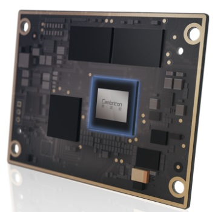

<p align="center">
    <a href="https://gitee.com/cambriconknight/mlu220-cross-compile-docker-image/tree/master/tools/watchdog">
        
        <h1 align="center">MLU220-SOM看门狗功能如何开启?</h1>
    </a>
</p>

# 1. 概述

默认没有开启Linux看门狗， 如要开启需要修改BSP源码包dts中的wdt status，重新编译升级MLU220-SOM。详细操作如下：

**Linux看门狗小知识**

Linux 自带了一个 watchdog 的实现，用于监视系统的运行，包括一个内核 watchdog module 和一个用户空间的 watchdog 程序。内核 watchdog 模块通过 /dev/watchdog 这个字符设备与用户空间通信。用户空间程序一旦打开 /dev/watchdog 设备（俗称“开门放狗”），就会导致在内核中启动一个1分钟的定时器（系统默认时间），此后，用户空间程序需要保证在1分钟之内向这个设备写入数据（俗称“定期喂狗”），每次写操作会导致重新设定定时器。如果用户空间程序在1分钟之内没有写操作，定时器到期会导致一次系统 reboot 操作（“狗咬人了”）。通过这种机制，我们可以保证系统核心进程大部分时间都处于运行状态，即使特定情形下进程崩溃，因无法正常定时“喂狗”，Linux系统在看门狗作用下重新启动（reboot），核心进程又运行起来了。看门狗功能多用于嵌入式系统。

# 2. 准备环境

**软件包:**

| 名称                   | 版本/文件                                              | 备注                                 |
| :-------------------- | :-------------------------------                      | :---------------------------------- |
| Linux OS              | Ubuntu16.04/Ubuntu18.04/CentOS7                       | 宿主机操作系统                         |
| MLU220-SOM交叉编译工具集 | mlu220-cross-compile-docker-image                    | MLU220-SOM交叉编译工具集               |
| Driver_MLU220         | cambricon-mlu220edge-driver-4.9.7-arm64.tar.gz        | MLU220驱动源码包                      |
| CNToolkit             | cntoolkit-edge_1.7.5-1_arm64.tar.gz                   | CNToolkit 包                      |

**下载地址:**

Driver: ftp://username@download.cambricon.com:8821/download/mlu220edge-driver-4.9.7-arm64/cambricon-mlu220edge-driver-4.9.7-arm64.tar.gz

CNToolkit： ftp://username@download.cambricon.com:8821/product/GJD/MLU220/1.7.602/mlu220edge/cntoolkit-edge_1.7.5-1_arm64.tar.gz

*注: 以上链接中的 [username] 需要替换为官方提供的专属FTP账户并使用对应密码下载。*

# 3. 修改源码

解压MLU220驱动源码包 cambricon-mlu220edge-driver-4.9.7-arm64.tar.gz, 得到如下目录结构:

修改BSP源代码文件: release/neuware/opensrc/opensrc/linux/arch/arm64/boot/dts/cambricon/cambr-c20e-common.dtsi

修改后:

```bash
wdt: wdt@8000001000 {
    compatible = "cambricon,cn_wdt";
    reg = <0x80 0x00001000 0x0 0x1000>,   /*ap wdt reg base*/
        <0x80 0x00000000 0x0 0x400>; /*top sysctl wdt pause*/
    topsctl-offset-mask = <0x8> , <0x10>;
    interrupts = <GIC_SPI 102 IRQ_TYPE_LEVEL_HIGH>;
    timeout-sec = <16>; /*2^(-10)*2^i i={0-15}*/
    clocks = <&sys_62p5m>;
    status = "ok";
};
```

修改前:

```bash
wdt: wdt@8000001000 {
    compatible = "cambricon,cn_wdt";
    reg = <0x80 0x00001000 0x0 0x1000>,   /*ap wdt reg base*/
        <0x80 0x00000000 0x0 0x400>; /*top sysctl wdt pause*/
    topsctl-offset-mask = <0x8> , <0x10>;
    interrupts = <GIC_SPI 102 IRQ_TYPE_LEVEL_HIGH>;
    timeout-sec = <16>; /*2^(-10)*2^i i={0-15}*/
    clocks = <&sys_62p5m>;
    status = "disabled";
};
```

# 4. 编译源码

编译BSP源码参考：https://gitee.com/cambriconknight/mlu220-cross-compile-docker-image#81-完整编译

# 5. 升级板卡

整理以下升级内容，拷贝到MLU220SOM板卡任意目录，执行upgrade.sh脚本进行升级。详细参考见: 【寒武纪SOM+SDK使用及开发指南_v1.7.0.pdf】

**升级内容**

```bash
.
├── bsp_md5.txt
├── bsp.tar.gz
├── cambricon_md5.txt
├── cambricon.tar.gz
├── neuware_md5.txt
├── neuware.tar.gz
└── upgrade.sh

0 directories, 7 files
```
*注1: bsp.tar.gz, bsp_md5.txt 是由MLU220驱动源码包解压并编译后生成[release/neuware/opensrc/opensrc/mlu220_build/build/out/bsp.tar.gz]。*

*注2: cambricon.tar.gz, cambricon_md5.txt 是由MLU220驱动源码包解压并编译后生成[release/neuware/opensrc/opensrc/mlu220_build/build/out/cambricon.tar.gz]。*

*注3: neuware.tar.gz, neuware_md5.txt 是由CNToolkit 包直接解压后得到[neuware/board/image/neuware.tar.gz]。*

**升级命令**

```bash
chmod +x upgrade.sh
./upgrade.sh
```

执行升级脚本, 升级大概需要几分钟, 升级过程会自动完成以下工作:

- 1. 将 bsp.tar.gz、cambricon.tar.gz、neuware.tar.gz、bsp_md5.txt、cambricon_md5.txt、neuware_md5.txt 存入 eMMC 的 boot 分区,检查 tar 包对应的 md5 值是否正确。如果没有发现任何可升级的文件,则退出升级;
- 2. 解压 bsp.tar.gz,将 Image_recovery、ramdisk_recovery.img、cambr‐c20e_recovery.dtb 和 fs.sys 更新至 boot 分区;如果没有 bsp.tar.gz 则跳过此步骤;
- 3. 更新 Nor Flash 的 bootloader;如果没有 bsp.tar.gz 则跳过此步骤;
- 4. 重启 reboot;
- 5. 加载 Image_recovery、ramdisk_recovery.img、cambr‐c20e_recovery.dtb 进入升级模式并启动 kernel;
- 6. 将 eMMC 的 boot 分 区 中 的 bsp.tar.gz 解 压 更 新 eMMC 的 boot 分 区 中 的 Image、ramdisk.img、cambr‐c20e.dtb 和 ubootenv.bin;
- 7. eMMC 的 boot 分区中的 cambricon.tar.gz 存在,则格式化 cambricon 分区,并将 cam‐bricon.tar.gz 解压至 cambricon 分区,并检查文件的 md5 值;如果没有 cambricon.tar.gz则跳过此步骤;
- 8. eMMC 的 boot 分区中的 neuware.tar.gz 存在,则格式化 neuware 分区,并将 cambri‐con.tar.gz 解压至 neuware 分区,并检查文件的 md5 值;如果没有 neuware.tar.gz 则跳过此步骤;
- 9. 完成升级,reboot 重启系统;

# 6. 验证看门狗

升级完成后, 就能看到这个看门狗字符设备了[/dev/watchdog]

```bash
[root@cambricon ~]# ls -la /dev/watchdog
crw-------    1 root     root       10, 130 Jan  1 00:00 /dev/watchdog
[root@cambricon ~]#
```

验证看门狗是否生效, 可以输入以下命令使系统挂掉. 挂掉后, 在看门狗的作用下系统会在小于1分钟时间内重启(通过串口可以观测到重新启动信息或者发现系统重启SSH断开).

```bash
echo xxx > /dev/watchdog; while true; do date;sleep 1; done
```
